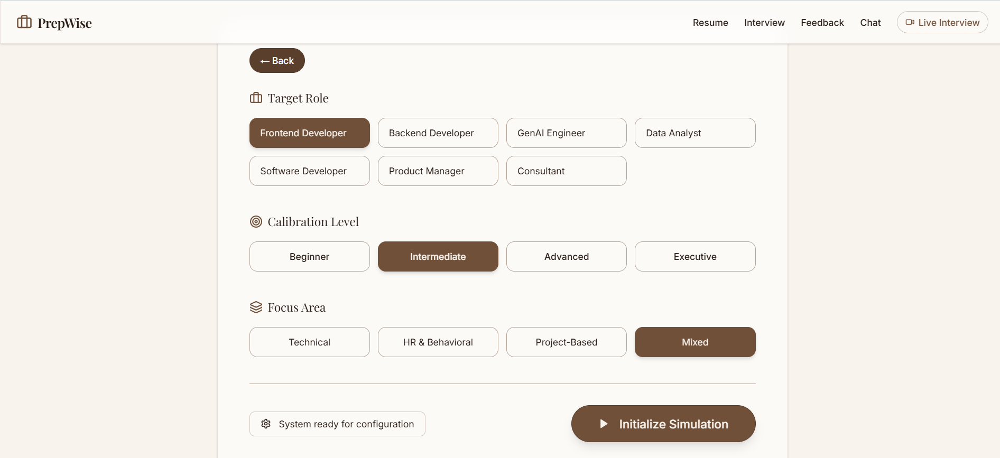
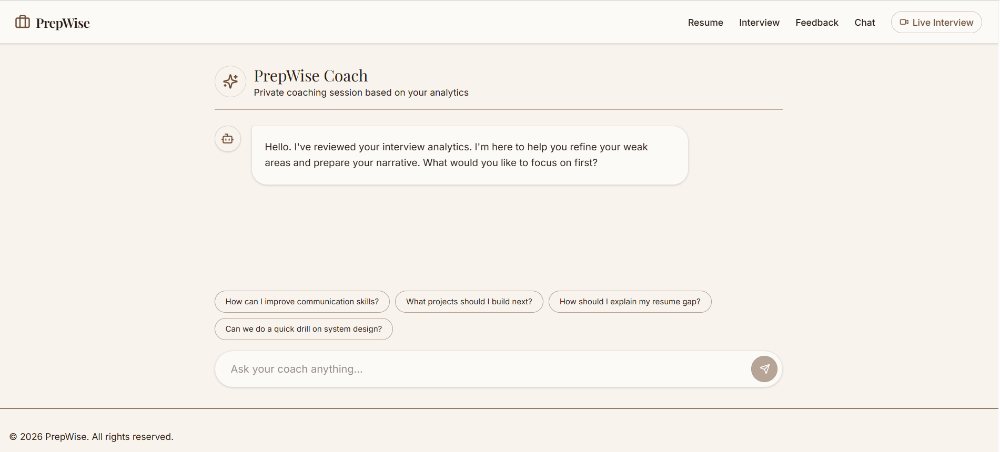

## Live Demo

**Live Application:**
# AI Interview Copilot

[](https://ai-interview-copilot-zb7b.vercel.app/)

An AI-powered interview preparation platform...

## About the Project

AI Interview Copilot is a modern interview preparation platform designed to simulate real interview experiences. The application provides AI-powered assistance during interview practice sessions, helping users formulate better responses and prepare for technical as well as behavioral interviews.

The project combines modern frontend technologies with Generative AI to create an interactive and engaging learning experience for students, freshers, and job seekers.

---

## Features

### Interview Practice

* Interactive interview environment
* Technical and behavioral interview support
* Real-world interview simulation

### AI-Powered Assistance

* Real-time AI-generated responses
* Context-aware answer suggestions
* Faster interview preparation

### Audio & Video Support

* Camera integration
* Microphone access
* Interactive communication experience

### Modern User Experience

* Responsive design
* Clean and intuitive interface
* Fast and smooth performance

---

## Tech Stack

### Frontend

* React.js
* TypeScript
* Tailwind CSS
* Vite

### AI Integration

* Groq AI API
* Prompt Engineering
* Real-Time AI Response Generation

### Deployment

* Vercel

### Version Control

* Git & GitHub

---

## Screenshots

### Home Page

Add your screenshot here:


### Interview Session



### AI Assistance



---

## Installation

Clone the repository:

```bash
git clone https://github.com/mishita27twr/Ai-Interview-Copilot.git
```

Move into the project directory:

```bash
cd Ai-Interview-Copilot
```

Install dependencies:

```bash
npm install
```

Run locally:

```bash
npm run dev
```

Build for production:

```bash
npm run build
```

---

## Challenges Faced

During development, several challenges were encountered:

* Managing browser microphone and camera permissions
* Handling asynchronous AI responses efficiently
* Creating a smooth and responsive user experience
* Optimizing deployment and production builds
* Managing application state during interview sessions

---

## What I Learned

This project helped me gain practical experience in:

* Building AI-powered web applications
* React and TypeScript development
* API integration and error handling
* Frontend deployment using Vercel
* Creating responsive and interactive user interfaces
* Working with modern Generative AI technologies

---

## Future Enhancements

* Resume-Based Interview Generation
* AI Interview Feedback Reports
* Voice Emotion Analysis
* Personalized Interview Recommendations
* Interview History Tracking
* Performance Analytics Dashboard
* Multi-Round Interview Simulations

---

## Developer

**Mishita Tiwari**

GitHub: https://github.com/mishita27twr
Linkdn : https://www.linkedin.com/in/mishita-tiwari/

---

## Support

If you found this project useful, please consider giving it a ⭐ on GitHub.

Your support helps motivate future improvements and new features.

---

### Practice Smarter • Interview Better • Build Confidence
